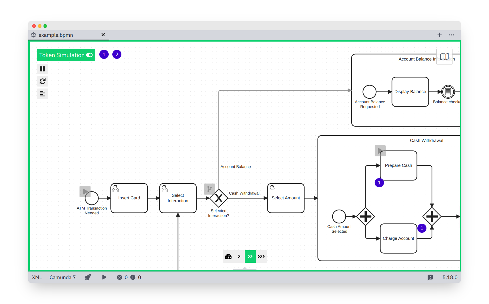

# Token Simulation for the Camunda Modeler

[bpmn-js-token-simulation](https://github.com/bpmn-io/bpmn-js-token-simulation) as a plugin for the [Camunda Modeler](https://camunda.org/bpmn/tool/).

## How to use

1. Download and copy this repository into the `plugins` directory of the Camunda Modeler
2. Start the Camunda Modeler
3. Simulate tokens in a regular BPMN tab

### Installing on macOS

Open a Terminal window and run the following commands:

1. `cd ~/Library/Application Support/camunda-modeler`
2. `mkdir -p resources/plugins`
3. `cd resources/plugins`
4. `git clone https://github.com/bpmn-io/bpmn-js-token-simulation-plugin`

Restart Camunda Modeler.

## Compatibility Notice

This plug-in is compatible with Camunda Modeler `v2.2+`.

## Additional Resources

* [List of existing plug-ins](https://github.com/camunda/camunda-modeler-plugins)
* [Plugins documentation](https://github.com/camunda/camunda-modeler/tree/master/docs/plugins)
* [Plugin starter project](https://github.com/camunda/camunda-modeler-plugin-example)

## Sample Video

https://user-images.githubusercontent.com/1748499/120363930-fa391180-c30c-11eb-9ea9-de1fec6665c1.mp4

https://user-images.githubusercontent.com/1748499/120363961-ff965c00-c30c-11eb-97b6-b432fa4fe79d.mp4

https://user-images.githubusercontent.com/1748499/120363990-07560080-c30d-11eb-9c3a-8cac447f09a0.mp4

## Licence

MIT
