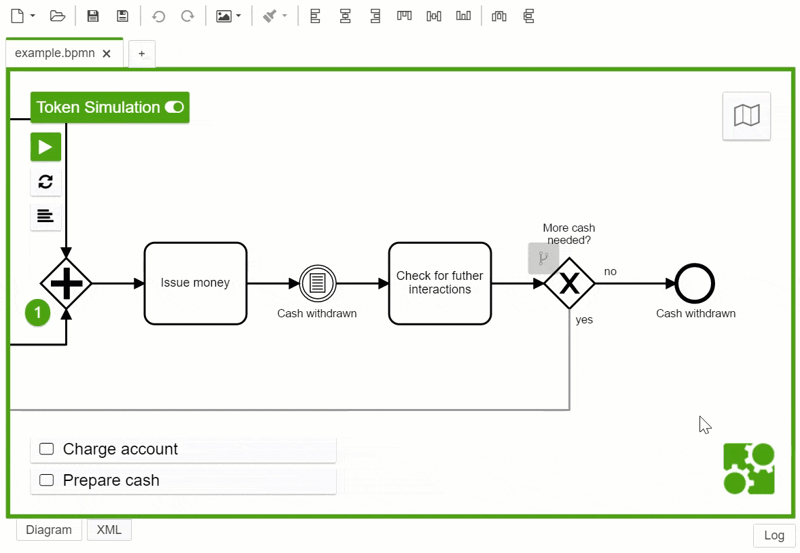

# Token Simulation for the Camunda Modeler

[bpmn-js-token-simulation](https://github.com/bpmn-io/bpmn-js-token-simulation) as a plugin for the [Camunda Modeler](https://camunda.org/bpmn/tool/).

## How to use

1. Download and copy this repository into the `plugins` directory of the Camunda Modeler
2. Start the Camunda Modeler
3. Simulate tokens in a regular BPMN tab

## Compatibility Notice

This plug-in is compatible with Camunda Modeler `v2.2+`.

## Licence

MIT
